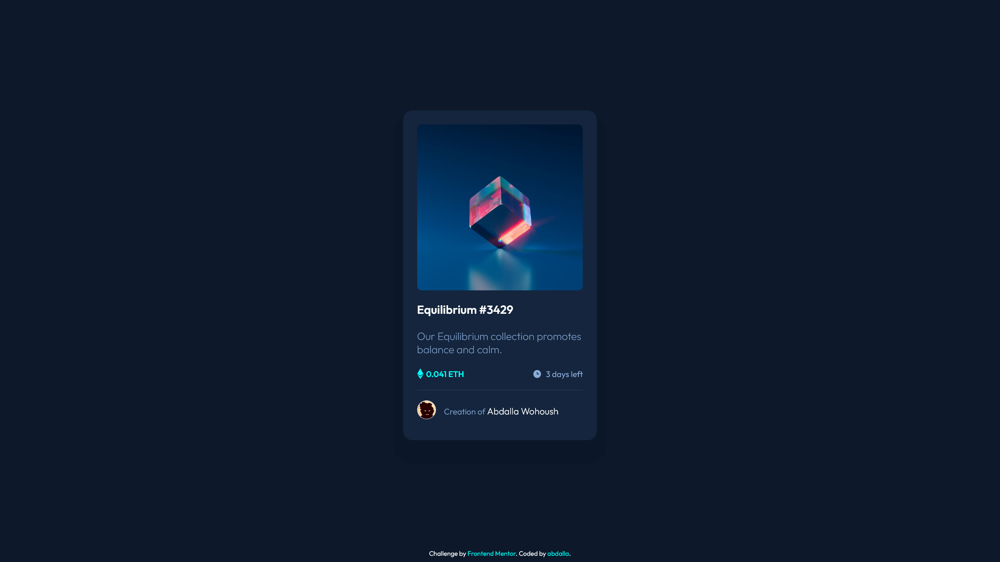

# Frontend Mentor - NFT preview card component solution

This is my solution to the [NFT preview card component challenge on Frontend Mentor](https://www.frontendmentor.io/challenges/nft-preview-card-component-SbdUL_w0U).

## Overview

### The challenge

Users should be able to:

- View the optimal layout depending on their device's screen size
- See hover states for interactive elements

### Screenshot

### Links

- Solution URL: [Frontend Mentor](https://www.frontendmentor.io/solutions/nft-preview-card-component-Aa1o4YCxlx)
- Live Site URL: [Vercel](https://nft-preview-card-component-teal-seven.vercel.app)

## My process

### Built with

- Semantic HTML5 markup
- CSS custom properties
- Flexbox

### What I learned

- Sometimes completely rewriting is better than fixing spaghetti code. it saves time, and it saves you the headaches, stress, anxiety, and energy.

- I got a subtle reminder that specificity is _HIGHLY_ important, I basically faced this issue where I had to figure out the sizing of the icons to get them just right, but later realized that the icons are already sized to be just like the design, but I had written styling that was way too unspecific.

- How zoomed in you are will sometimes cause some subtle issues, like a horizontal line not appearing, or a circular image subtly clipping into it's border. next time I face something subtle like that, I'll make sure it's not just the zoom before trying to debug it.

- When writing code for a specific resolution, it's a life saver to use the browser's inspect element's device toolbar to adjust the resolution so you can focus on the design being accurate for it's specific size.

- On FireFox `
` can be styled using the `color` styling property, which is NOT the case for chromium based browsers like Opera. initially I used a `
` with `border-top` styling to get past this issue _(which I tried on `
` beforehand and it didn't work)_. but coming back to this issue, I realized that styling `
` is the same, except it's with the `border` property instead if `border-top`.

### Continued development

- I haven't done the mobile phone sizing for this yet, although I'll admit it's because I have found that the differences in the designs between screen sizes are negligible.

### Useful resources

- [W3Schools](https://www.w3schools.com/css/css3_images.asp) - This helped me with the hover styling over the image. also helped me brush up on the Position property.
